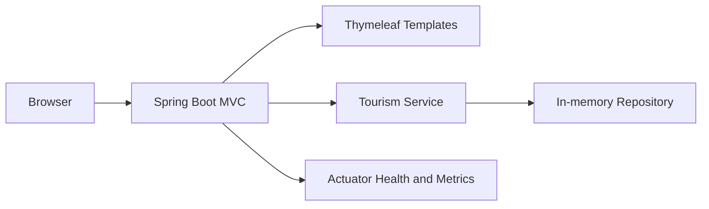
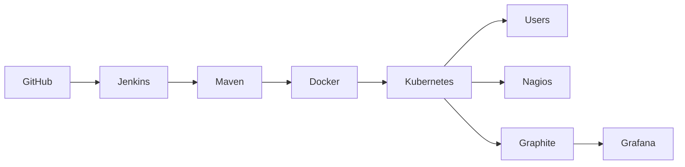
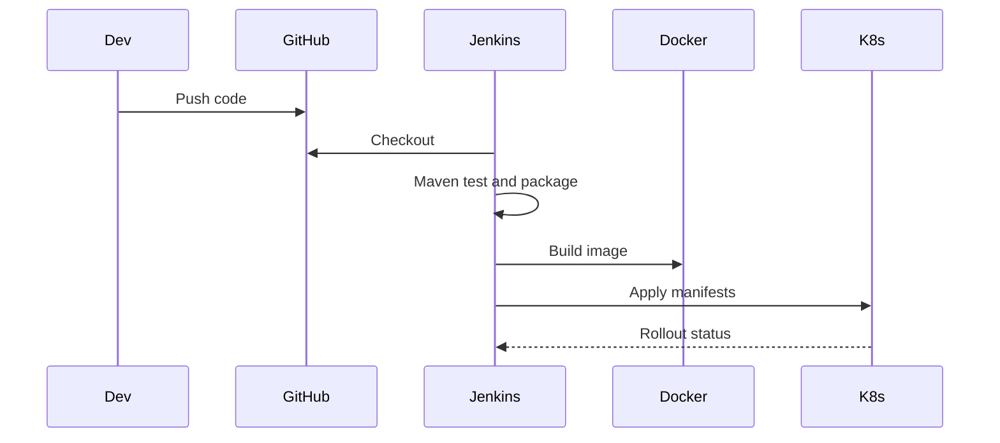

# Smart Tourism Information Portal

A complete Java 21 Spring Boot tourism information website with Thymeleaf UI, H2 demo database settings, Docker, Jenkins, Kubernetes, Nagios, Graphite, Grafana, and GitHub Actions assets.

## Features

- Home, about, attractions, hotels, travel guides, gallery, maps, travel tips, booking links, contact form, and admin dashboard
- Responsive Bootstrap 5 UI with dark mode
- Standalone static frontend pages are available in `frontend/`
- Spring MVC controllers, service layer, repository layer, models, actuator health endpoints
- Maven build, Docker image, Jenkins pipeline, Kubernetes manifests, and monitoring configuration

## Architecture







## Local Setup

Requirements: Java 21, Maven, Git, Docker Desktop, Minikube, kubectl, Jenkins.

```bash
mvn clean install
mvn test
mvn package
java -jar target/smart-tourism-portal-1.0.0.jar
```

Open `http://localhost:8085`.

## Static Frontend

Open `frontend/index.html` directly in a browser to view the standalone HTML, CSS, Bootstrap, and JavaScript frontend pages.

## Docker

```bash
docker build -t smart-tourism-portal:1.0.0 .
docker images
docker run -d --name smart-tourism-portal -p 8085:8085 smart-tourism-portal:1.0.0
docker ps
```

## Kubernetes

```bash
kubectl apply -f kubernetes/
kubectl get pods -n tourism
kubectl get svc -n tourism
kubectl get deployments -n tourism
kubectl describe pod -n tourism
kubectl rollout status deployment/smart-tourism-portal -n tourism
```

## Jenkins Freestyle Job

Jenkins is already using `http://localhost:8080`, so the Spring Boot application runs on `http://localhost:8085`.

Create a Freestyle project instead of a Pipeline job:

1. Open Jenkins at `http://localhost:8080`.
2. Select **New Item**.
3. Enter `Smart-Tourism-Portal-Freestyle`.
4. Select **Freestyle project**, then click **OK**.
5. Under **Source Code Management**, select **Git**.
6. Enter the repository URL.
7. Set the branch to `*/main`.
8. Under **Build Steps**, select **Execute Windows batch command**.
9. Enter this command:

```bat
call jenkins-freestyle-build.bat
```

10. Under **Post-build Actions**, select **Archive the artifacts**.
11. Set **Files to archive** to:

```text
target/*.jar
```

12. Click **Save**.
13. Click **Build Now**.

The Freestyle build script performs Java verification, Maven verification, `mvn clean`, `mvn test`, `mvn package`, Docker image build, old container removal, Docker container run, optional Kubernetes deployment when Minikube is running, pod verification, and service verification.

Before running the Jenkins job, confirm that the Jenkins Windows agent has Java 21, Maven, Docker Desktop, Git, and optional kubectl/Minikube available on `PATH`.

### Optional Pipeline Job

The repository also contains a corrected Declarative Pipeline file at the repository root:

```text
Jenkinsfile
```

If you create a Pipeline job later, use this Jenkins Script Path:

```text
Jenkinsfile
```

## Monitoring

- Nagios: use `monitoring/nagios/smart-tourism.cfg`.
- Graphite: run `docker compose up -d graphite`.
- Grafana: run `docker compose up -d grafana`; Graphite datasource and dashboard are provisioned automatically.

### Localhost Ports

| Tool | Local URL | Port | Purpose |
| --- | --- | --- | --- |
| Jenkins | `http://localhost:8080` | `8080` | CI/CD pipeline dashboard |
| Graphite | `http://localhost:8081` | `8081` | Metrics storage and Graphite web UI |
| Nagios | `http://localhost:8082` | `8082` | Host and service monitoring dashboard |
| Grafana | `http://localhost:3000` | `3000` | Metrics dashboards |
| Smart Tourism App | `http://localhost:8085` | `8085` | Main Spring Boot website |

Use this recommended local setup to avoid port conflicts:

- Jenkins: `8080`
- Graphite: `8081`
- Nagios: `8082`
- Grafana: `3000`
- Spring Boot application: `8085`

Example Docker Compose monitoring commands:

```bash
docker compose up -d graphite
docker compose up -d grafana
```

Then open Grafana at `http://localhost:3000` and verify that the Graphite datasource is available.

## Git And GitHub

```bash
git init
git add .
git commit -m "Initial Smart Tourism Portal"
git branch -M main
git remote add origin <repository-url>
git push -u origin main
```

## Troubleshooting

- Maven build fails: verify `java -version` shows Java 21 and run `mvn -U clean verify`.
- Docker cannot find jar: run `mvn package` before `docker build`.
- Kubernetes image pull fails in Minikube: run `minikube image load smart-tourism-portal:1.0.0`.
- App health: check `http://localhost:8085/actuator/health`.

## Future Scope

Add authentication, persistent database storage, payment gateway integration, real map API keys, centralized logging, and production-grade observability.
